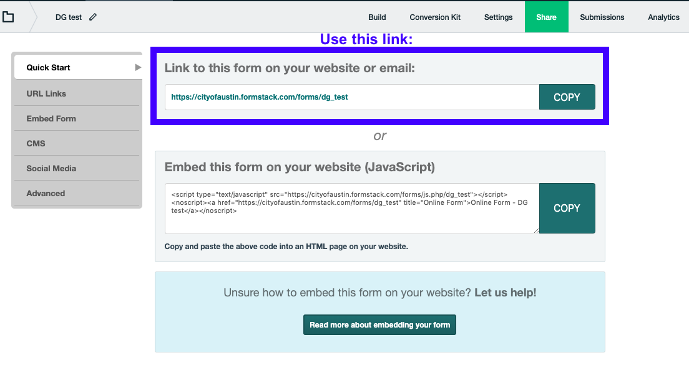

# Form container page

Forms are used to collect information from residents and are often part of a service. It is important to consider the service that the form supports when writing a form. Include the steps for the resident to complete their task, and set expectations for what will happen after the resident submits the form. If you are creating a form on austin.gov, include these steps and expectations on a service page where you can include a link to your form.

## Going digital

Whenever possible, make a digital form rather than a PDF. PDFs do not always work well in a browser and are often inaccessible for people who have vision impairments. Many residents use their phones to access the web and don’t always have access to a computer or printer, so requiring users to print and fill out a form by hand is also inaccessible. 

Read the [City of Austin’s Digital Forms Guide](https://city-of-austin.gitbook.io/digital-forms-guide/) for more information about best practices.

## Create a form for austin.gov

### Build the form in Formstack

To create a form on austin.gov, you will need access to Formstack, which you can request through [ServiceNow](https://gcc01.safelinks.protection.outlook.com/?url=https%3A%2F%2Fatx.service-now.com%2Fsp&data=02%7C01%7CSarah.Rigdon%40austintexas.gov%7C1706252d70084477b7f308d7ab3fe6b6%7C5c5e19f6a6ab4b45b1d0be4608a9a67f%7C0%7C0%7C637166163247336510&sdata=RbK2N291YLu5A0qeWBmqwxAyDKi1pRhMOjMb1COnTdA%3D&reserved=0). With the alpha.austin.gov style theme, almost all style decisions are made automatically. One exception: whenever adding a description field, manually select an 18 pt text size.

Do not include a title or description at the top of the form. You will add this in the form container in Joplin.

#### **Write an effective form description**

Write a description that provides any information residents might require before filling out the form, including the type\(s\) of information that will be requested and how it will be assessed or used. You can also link back to the service page for more details. 

#### Write an effective confirmation message

What happens when you click Submit at the end of a form? Good forms include a customized message at the end of your form to set expectations for the future. This is commonly referred to as a confirmation message, success message, or submission message. Let them know how long the form will take to be processed or when they can expect to hear back, even if it’s an estimate, plus who they can contact for help. Also, provide a link back to a relevant service page.

#### Find your form link

After creating your form in Formstack, copy the top link provided in the Share tab. You will need to paste this link in Joplin.

### Build a form container in Joplin

#### **Write an accurate form container title** 

Form container titles need to be clear, specific, and accurately describe the online form. Usually, the form will be linked to from a service page that describes the service and other ways to access it, such as filling out a paper form or calling a number. It should be less than 58 characters so it doesn't get cut off in search results. The form container should not have the same title as its corresponding service page. 

The title should clearly communicate what a user can accomplish by using the form. The title should also include phrases and words people may search to access this content. 

Good form container title examples: 

* Smoking in public places complaint form \(corresponding service page title: Report smoking or vaping in a public place\)
* Apply to serve on the Community Police Review Commission \(Corresponding service page title: Serve on the Community Police Review Commission\)
* Request a day laborer \(This form is specifically about making a request to hire. Corresponding service page about the service and other ways to hire: Hire a day laborer\)

#### Write an effective form container description

Tell the resident what they can achieve by using the form. Be concise and direct, including only essential information. Any additional info will be included in the Formstack form description. It should be 254 characters or less.

**Add your Formstack link**

You can get your embed link from the Formstack “Share” tab.

### Get started

[Request a Formstack account](http://atx.service-now.com/sp)**.**

Formstack has [helpful video guides](https://cityofaustin.formstack.com/admin/learn/dashboard?sso=5e5fc05baa3a7) for starting out.

