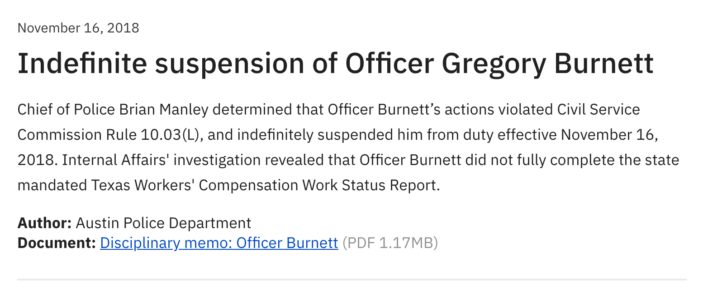

# Official documents page

Normally we advocate against linking to PDFs on a web page, but one exception is legal artifacts with signatures, stamps, seals, or redactions. The official documents content type was designed for users to read a brief overview of a complex or long legal artifact in a downloadable file format, as well as its size, before clicking the link to download.

If you want to publish information currently in a PDF that is not a legal artifact, first consider using a Service or Information page. If you have a large volume of PDFs that you want to share with residents, reach out to the Office of Design and Delivery for help: [odd@austintexas.gov](mailto:odd@austintexas.gov).

## **Write a concise title.**

Titles need to be clear, concise, and specific. A good title conveys exactly what kind of documents can be found on the page.

## **Write a concise page description.**

Using 1-2 complete sentences and accessible language, describe what can be found on the page. Steer clear of acronyms, abbreviations, and jargon. The description can include the department name and the purpose of sharing the documents. For example, this is the Official Documents description for the Office of Police Oversight:

> As part of our mission, the Office of Police Oversight publishes official documents related to the complaint investigation process and disciplinary decisions made by the Austin Police Department.

**Add entries.**

When adding entries, you will need to write or upload the following fields:

1. Document date
2. Title
3. Authoring office
4. Document summary
5. Name of document, or hyperlink text of the downloadable file
6. Document upload

The information will display on the website in this layout:

Usually, the information for fields 1, 2, and 3 can be found in the document itself.

To write a document summary, read the document and create an unbiased and digestible synopsis of the text. Whenever possible, try to include any key names, governing bodies, and outcomes or actions. Use active voice—not only does it help keep the reading level accessible for all residents and less expensive to translate, it also helps increase transparency with residents.

The “Name of document” field is the hypertext of the downloadable file. Each department will have its own convention for this, but it can be the same as the entry title. Key information might include the type of document it is. The automatically generated size of the PDF size will appear in parentheses next to the name of the document.

When uploading a document, make sure the title and file name are clear and findable for you. Residents will see only what you enter in the “Name of document” field.

