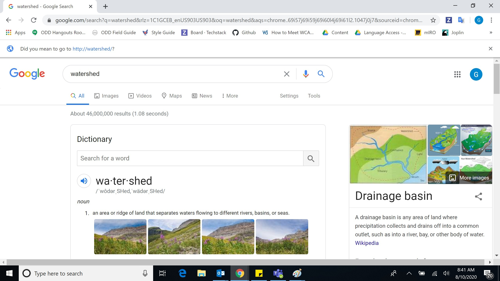
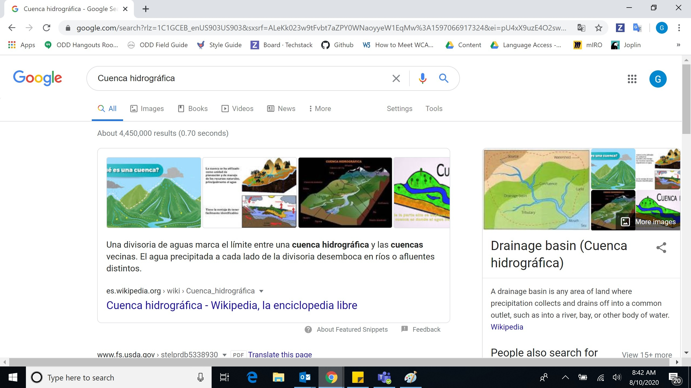
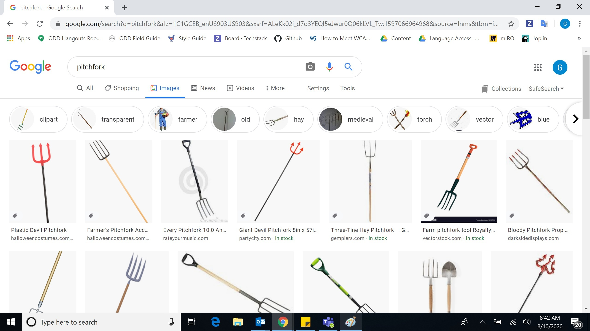
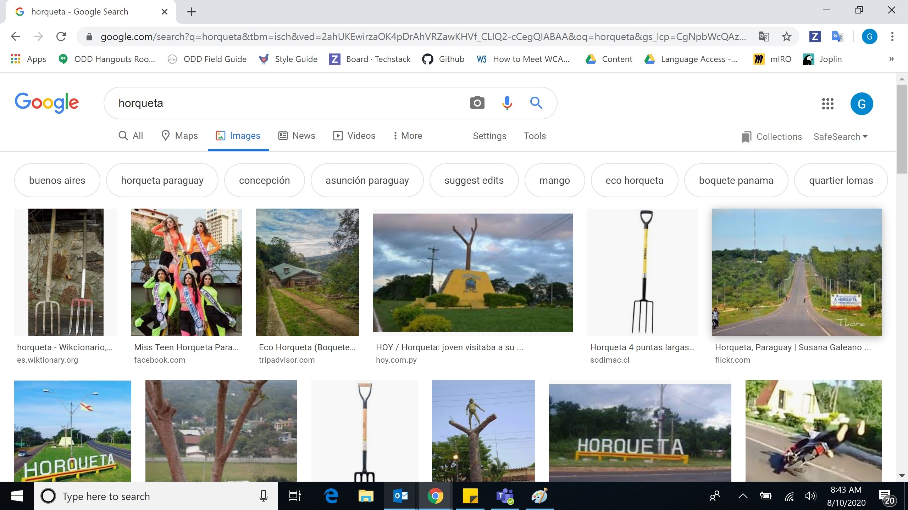
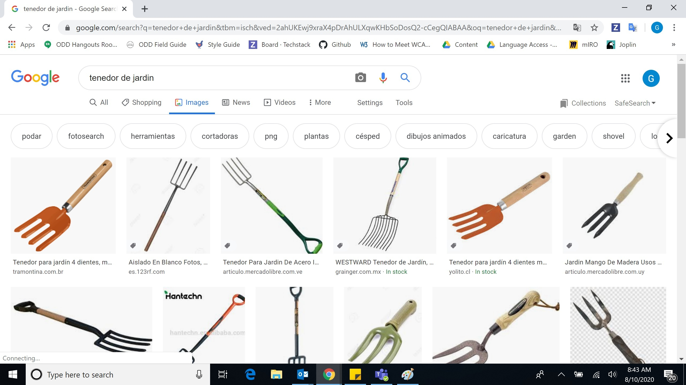

# Translate your content

## Suggestions for tackling translations

### Write with brevity. 

Residents are busy and often accessing web content on their phone. 

### Use plain language in order to make content accessible to the widest possible audience. 

* Use short sentences and paragraphs.
* Avoid government jargon.
* Use pronouns.
  * The user, or resident, is “you/usted”
  * “We/Nosotros” are City government and staff speaking to the resident.
* Use active voice.
  * “The mayor held a community input meeting.” NOT “A community input meeting was held by the mayor.”

Read Laura Godfrey’s [Lost in Translation](https://digital.gov/2012/10/01/automated-translation-good-solution-or-not/) for more context and rationale informing this philosophy.

## **Spanish-language considerations**

### Terminology lists

Use our [List of Preferred Spanish Translations](https://docs.google.com/spreadsheets/d/1gEyX6ayn1TW7CQxngsMT9pej-egMWxCtxAzRWXAeLfM/edit#gid=0), and please don’t hesitate to let us know if a word should be re-evaluated or added. Common rationales for word choice include:

* Cohesiveness - Multiple words would work equally well, but let’s pick one and stick to it.
* Economy of language - If you can say the same thing in less words, do.
* Accessibility - A word is more commonly used than another or would be understood by someone with a lower level of education.
* Specificity - One word might encompass the meaning, but another is more specific. Or one word has multiple meanings and the other has just one.

When referring to federal agencies, refer to this [official list of translations for U.S. federal agencies**.**](https://www.usa.gov/style-guide/spanish-translations-departments-agencies)

## Linguistic diversity

Keep in mind that not only is our audience potentially from many different countries, but  their primary language may be something other than Spanish, or they may have received little formal education. Choose the words that will be understood by the largest portion of the local Spanish-speaking population.

We need further research about who this is. For now, let’s defer to institutions that have been dealing with Hispanic linguistic diversity in the United States for a long time such as [Univision](http://univision.com), [Telemundo](http://telemundo.com) and [Spanish in Texas](https://spanishintexas.org/). 

The Royal Academy of Spain \(RAE\), while a useful supplement, should not be the preeminent authority here for because while the RAE does consult language academies throughout Latin America and produce a “Dictionary of Americanisms,” there is currently no academy for Spanish spoken in the U.S., let alone in Texas. Spanish is a colonial language but we do not want to reproduce systems of coloniality in the contemporary usage of that language by continuing to defer to authorities in Spain.

### Prioritize common usage.

Googling the term in English and Spanish is a useful way to verify that you have the correct term.

Here’s an example of what we want: “watershed” and “cuenca hidrográfica”

Here’s an example that would warrant further thinking: “pitchfork” and “horqueta”

As you researched other possible translations for pitchfork, you would come across “tenedor de jardín.” 

Another way you might use Google is to get a rough idea about the frequency of two words that have the same meaning. All else being equal, choose the more frequently used word. Google Translate also has a frequency score you can use.  For example, there are many more results for "Costo" than "Coste".

| **Costo**  | Coste |
| :--- | :--- |
| 372,000,000 results | 94,700,000 results |

[Google Trends](https://trends.google.com/trends/) is also a useful source for searching the frequency of search terms in the United States.

### Include the English term when necessary.

If the English term is common and the Spanish term is not, it is ok to put the English in parentheses. For example: 

* \(WIC, en ingles\)
* \(styrofoam\)
* \(easement\)

### **Keep these conventions in mind**

* Use the formal “Usted” to address the user.
* Use -a/o for gendered words.
* If you are linking to content, make sure the link is also in Spanish when possible. When a link text takes the reader to an English page, denote that in the hyperlink “\(en inglés\)”.
* Avoid using historical present \(presente histórico\) verb tense. It may be confusing to people with low literacy or cognitive disabilities. 
* Do not translate addresses \(i.e. “street” “parkway” “court”\).
* Numbering conventions
  * Use the American way to write numbers: $1,276.50 not $1.276,59.
  * Use Spanish-order for dates \(3 de octubre de 2014\). 
  * Use AM/PM rather than military time.
  * Billion = Billón \(1,000,000,000\) and Trillion = Trillón \(1,000,000,000,000\).

  

